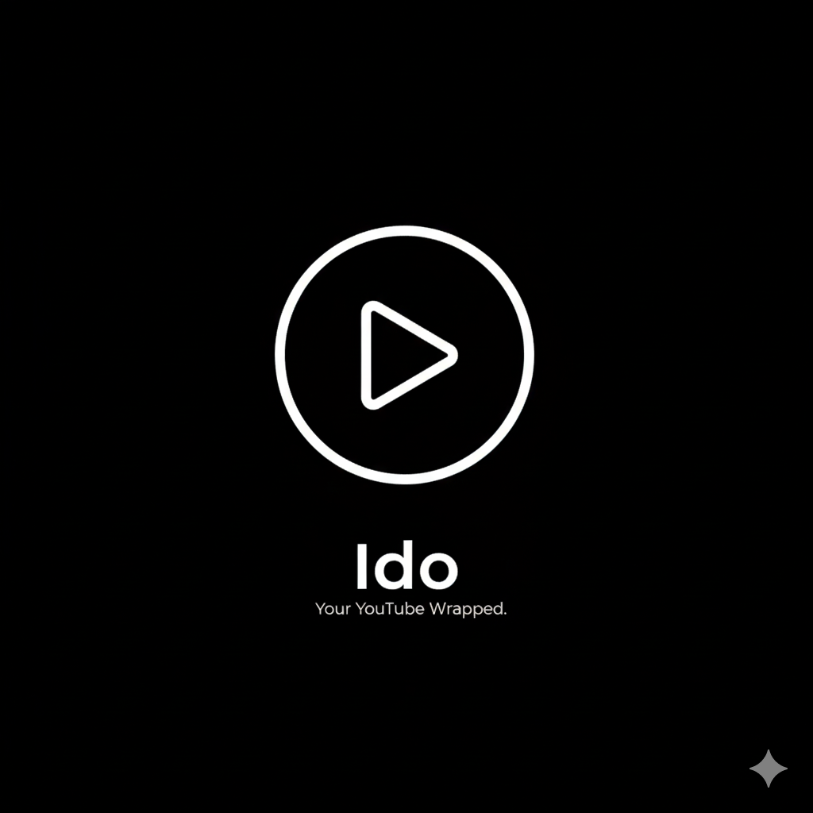

<p align="center">
  
</p>

<h1 align="center">Ido</h1>

<p align="center">
  <strong>Your YouTube Wrapped — Discover your year in videos</strong>
</p>

<p align="center">
  Upload your YouTube Takeout data and get beautiful, shareable insights about your watching habits.
</p>

<p align="center">
  <a href="#motivation">Motivation</a> •
  <a href="#features">Features</a> •
  <a href="#demo">Demo</a> •
  <a href="#installation">Installation</a> •
  <a href="#usage">Usage</a> •
  <a href="#tech-stack">Tech Stack</a> •
  <a href="#contributing">Contributing</a>
</p>

---
## Motivation

I was pretty disappointed with this year's YouTube Wrapped feature and felt that their insights were not enough. I thought it would be fun to create something similar but with more insights and a better design. So, I took inspiration from Spotify Wrapped and created Ido. A platform where you can explore your YouTube journey and get beautiful, shareable insights about your watching habits. It's privacy-first and doesn't store any of your data on our servers. Please free to check it out at [Ido](https://ido-by-parth.vercel.app).

Also please feel free to contribute to this project. I'm always looking for new ideas and features to add. Please free to open an issue or submit a pull request. If you like what I'm doing, please consider giving it a star on GitHub. I'm working on adding Topic modelling based insights and more. Stay updated!

## Features

- **19 Insight Cards**: Beautiful, Spotify Wrapped-style cards showing your YouTube journey
- **Privacy First**: All processing happens in-memory — your data is never stored on our servers
- **Pattern Discovery**: Association rule mining reveals hidden viewing patterns
- **Watch Cycle Visualization**: Polar chart showing your 24-hour activity
- **Habit Detection**: Find channels you watch regularly
- **Binge Tracking**: Discover your longest watching sessions
- **Late Night Stats**: See your after-midnight viewing habits
- **Search Insights**: What you searched for most
- **Subscription Analysis**: Ghost subscriptions exposed

## 🎯 Demo

Try the demo with sample data: [Live Demo](/wrapped-demo)

### Cards Preview

| Intro | Stats | Top Channels |
|-------|-------|--------------|
| Personalized welcome | Videos watched, channels explored | Your most-watched creators |

| Watch Cycle | Patterns | Habits |
|-------------|----------|--------|
| 24-hour polar chart | AI-discovered insights | Regular viewing habits |

## 🚀 Installation

### Prerequisites

- Node.js 18+
- Python 3.11+
- pnpm (recommended) or npm

### Frontend Setup

```bash
cd ido_frontend
pnpm install
cp env.example .env.local
# Edit .env.local with your settings
pnpm dev
```

### Backend Setup

```bash
cd backend
python -m venv venv
venv\Scripts\activate  # Windows
# source venv/bin/activate  # Mac/Linux
pip install -r requirements.txt
python -m spacy download en_core_web_sm
uvicorn main:app --reload --port 8000
```

## 📖 Usage

1. **Get your YouTube data**: Go to [Google Takeout](https://takeout.google.com/), select only YouTube, and download the ZIP
2. **Upload**: Drop the ZIP file on the Ido homepage
3. **Select timezone**: Choose your local timezone for accurate insights
4. **Explore**: Swipe through your personalized Wrapped cards!

### API Endpoints

| Endpoint | Method | Description |
|----------|--------|-------------|
| `/api/wrapped/generate` | POST | Generate wrapped cards from ZIP |
| `/api/health` | GET | Health check |

## 🛠️ Tech Stack

### Frontend
- **Next.js 15** — React framework
- **Tailwind CSS** — Styling
- **shadcn/ui** — UI components
- **Lucide** — Icons

### Backend
- **FastAPI** — Python web framework
- **spaCy** — NLP for language detection
- **pytz** — Timezone handling

### Deployment
- **Frontend**: Vercel / Netlify
- **Backend**: Hugging Face Spaces (Docker)

## 📁 Project Structure

```
ido/
├── ido_frontend/          # Next.js frontend
│   ├── app/               # App router pages
│   ├── components/        # React components
│   │   └── wrapped/       # Wrapped card components
│   └── lib/               # Utilities
├── backend/               # FastAPI backend
│   ├── api/               # Route handlers
│   ├── services/          # Business logic
│   │   ├── wrapped_service.py    # Card generation
│   │   └── preprocess_service.py # Data processing
│   └── Dockerfile         # HF Spaces deployment
└── docs/                  # Documentation
```

## 🔒 Privacy

- **No data storage**: Your YouTube data is processed in-memory and immediately discarded
- **No tracking**: We don't use analytics or tracking
- **Open source**: Audit the code yourself

## 🤝 Contributing

Contributions are welcome! Please feel free to submit a Pull Request.

1. Fork the repository
2. Create your feature branch (`git checkout -b feature/AmazingFeature`)
3. Commit your changes (`git commit -m 'Add some AmazingFeature'`)
4. Push to the branch (`git push origin feature/AmazingFeature`)
5. Open a Pull Request

## 📧 Contact

- **Email**: parthnuwal7@gmail.com
- **GitHub**: [@Parthnuwal7](https://github.com/Parthnuwal7)

## 📄 License

This project is licensed under the Dual use License (Free for personal use, commercial use requires permission) - see the [LICENSE](LICENSE) file for details.

---

<p align="center">
  Made with ❤️ by <a href="https://github.com/Parthnuwal7">Parthnuwal7</a>
</p>
